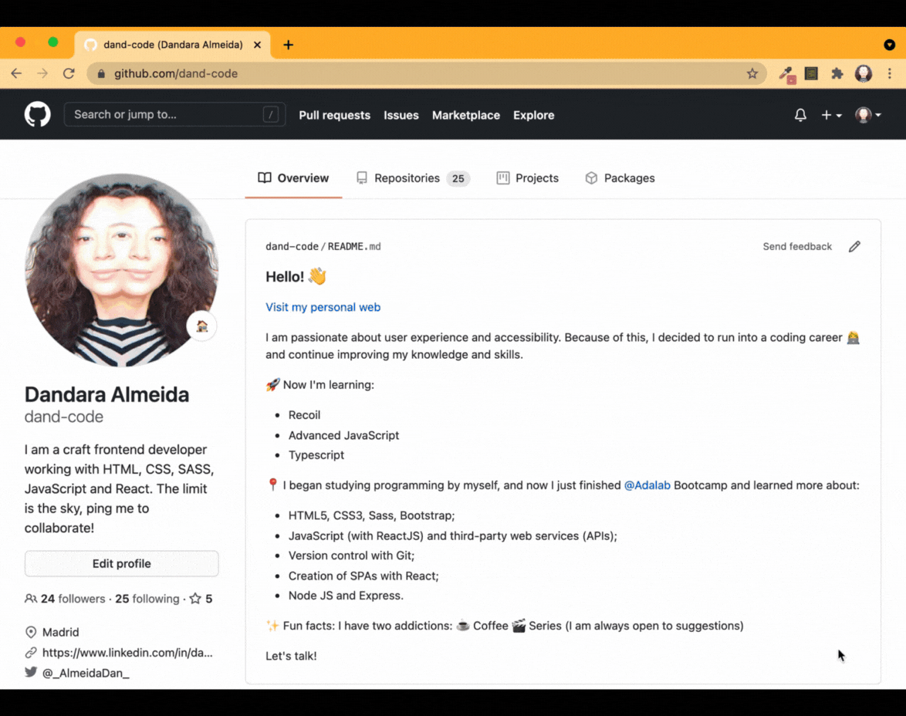

# 🚧 Work in progress 🚧

Lately, I've been reading a lot of books and content in English and I always make notes on my cell phone of new words and expressions.

The problem is that the tool is pretty limited. It does not allow me to sort alphabetically, and it does not allow me to group by themes, nor is it possible to translate automatically.

I'm programming a plugin for Chrome to solve this problem and, why not, help other people.

__So far I have managed to reproduce exactly what my notebook does:__
- add new words, 
- delete an item from the list and 
- delete all items.

Among other improvements, __the challenge now is to make the browser recognize the words stored in my list a long the websites and allow me to access the notes of those words.__

I'm in full production. I hope to be able to share the results soon.