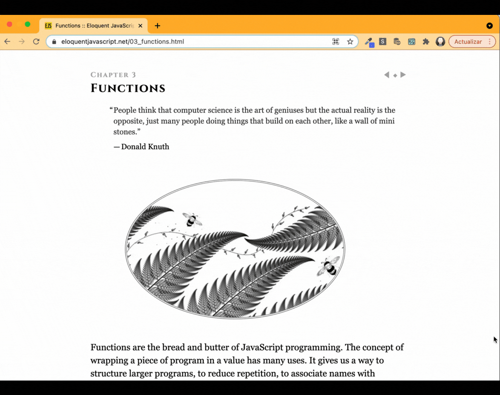

# PopUpWords



### Motivation
Maybe my problem with the new word list could be the same to you: I never came back to reread it to remember the new vocabulary. To solve this, PopUpWords will search for an exact text match on any web page, without care about uppercase or lowercase inputs.

The PopUpWords  proposal is to create a word list with notes on what it means and how to use it while you are browsing through your favorite websites. In other words, while the user is on any web page or reading a digital document in English, the extension will highlight the word or sentence that is on the user list. 

For this version, the Chrome extension works with English language, but the idea is to expand it. 

## Project

### Main Goals
- [x] Add a new entry;
- [x] Delete an entry;
- [x] Persist the state of the word list;
- [x] Communicate extension with all user browser windows;
- [x] Identify the words on the browser;
- [x] Access the notes on  the browser;
- [x] Button enable/disable the extension;
◊
### Technology used
- Javascript
- React
- Recoil
- Testing-library
- Sass

## Some decisions:
#### Extension without translate API:

That was one of my first troubles. I would like to type a word and the plugin should be prepared to translate it with an external API, but I did not find any fee-free service. So the option was to create a second input type text to be filled in by the user. 

Even because that wouldn't be a hard job.

#### Communication between extension and Chrome tabs:
Two permissions have been established in the `manifest.json`:
```javascript
{
 "name": "PopUpWords App",
...
 "permissions": [
   "storage", "activeTabs", "tabs"
 ],
 ...
}
```
For the extension to work as expected, it was necessary to get the words/notes stored in the extension list to be received in the local storage of the browser tabs where the user is logged.

The “chrome.runtime” API was used to retrieve the user's browser and then listen for and respond to events in the extension's lifecycle.

`replacement_words.js`:
```javascript
chrome.runtime.onMessage.addListener(
        function (request, _sender, _sendResponse) {

            highlighter.resetHTML();
            if (request.activated === false)
                return true;
            if (Array.isArray(request.words))
            {
                highlighter.updateWords(request.words);
                highlighter.highlightWords();
            }
            return true;
         }
);
```

The “highlightWords()” function collects each word in the list, performs a global and case-insensitive search in the browser, and, if it matches, transforms the HTML of the words found by adding a span with styles that allow highlighting them on screen and changing the cursor to pointer style when focused.

`replacement_words.js`:
```javascript
_highlightWord(word, note) { 
        const regExp = new RegExp(word, "ig");
        document.body.innerHTML = document.body.innerHTML.replace(regExp, `<span style='background: yellow; cursor:pointer;' title='${note}'>$&</span>`)
}
```

#### Testing
All tests were built with a user experience based. It means that it did not use mocks or fake data to run the tests but simulated all user interaction with the app and tested if the expected content or behavior showed on the screen. The benefit is to have more readable tests.

App is a presentation component. There is no logic on it, just elements rendered. So, to test this component I have comprove that the element was on the screen the first time I opened the application. To not use the snapshot, which is a very weak method of proving something is rendered, I used the **"screen"** and **"getByRole"** to do this.

Now it's time to test the logic implemented in the application (until this phase of the project). Until now the user can add words/notes, delete an element from the list or delete all of them.

To add words/notes it is mandatory to fill in both form fields. So at least 5 scenarios were proven and for all of them I tried to simulate the user action step by step:
- add a new word/note (no error);
- save the new input in place;
- write a word without a note (error);
- write a wordless note (error;
- try to add both blank inputs (error).

Wonderful! We can save words/notes, we just need to test if we can delete them.
Unlike the Delete All button, the X button to delete only one item is added to each new word/note and is related to this input through an id (d_${word}), which was used to identify it in the tests.

As for the case of deleting All and x, before checking if the elements had been deleted, I also checked that the elements were on the screen.

## Life is not a bed of roses:
